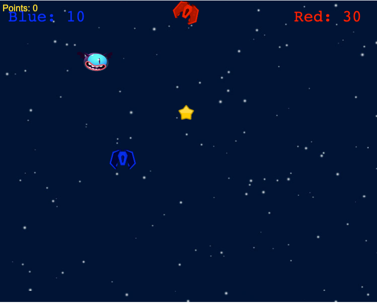

# Game: starships

## Project setup
```
yarn install
```

### Compiles and hot-reloads for development
```
yarn serve
```

## Built-on
- [Phaser3](https://github.com/photonstorm/phaser)
- Vue.js - v2+
- socket.io
- node.js (as backend server) - v14+
- mongoDb 
- docker + docker-compose

## Game




## Next steps
- [ ] Authentication(just username)
- [ ] Choose command (griffindor vs slizerin)
- [ ] List of players on-line
- [ ] List of active rooms
- [ ] AI-bots
- [ ] Better navigation
  - [ ] acceleration
- [ ] Several weapons??
- [ ] Shield
- [ ] Super bomb/some random bonuses
- [ ] End of game/Round
- [ ] Full screen
- [ ] Spaceship => guys on broom
- [ ] Balls
  - [ ] hunters
  - [ ] snitch
  - [ ] basic score ball or just random objects that give +1 score
